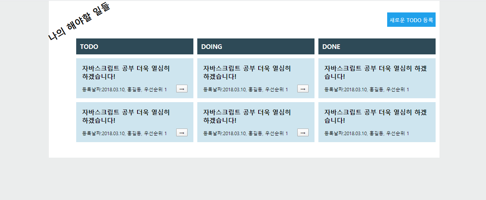
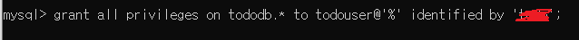
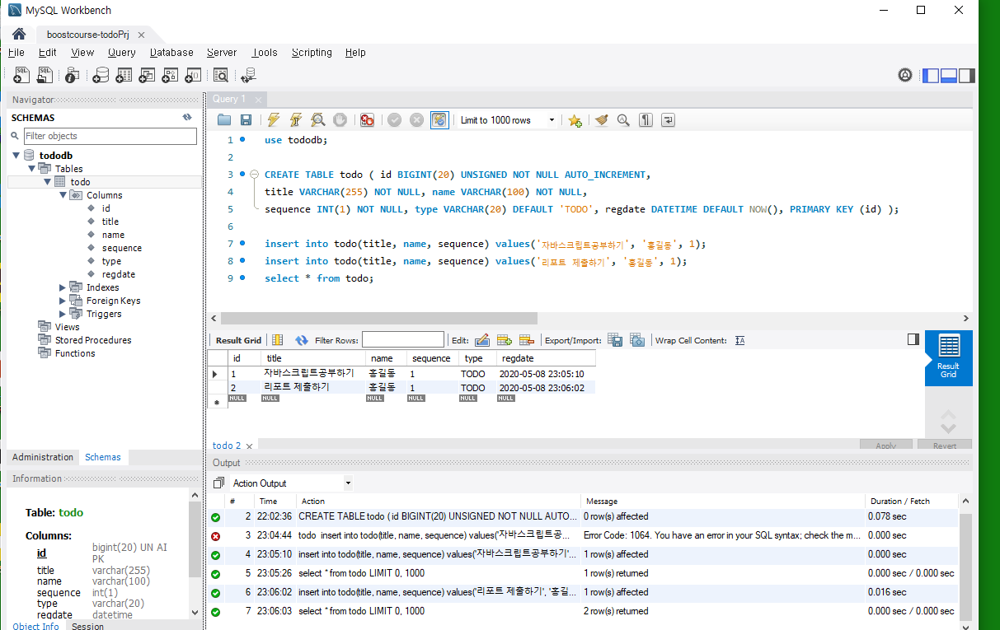
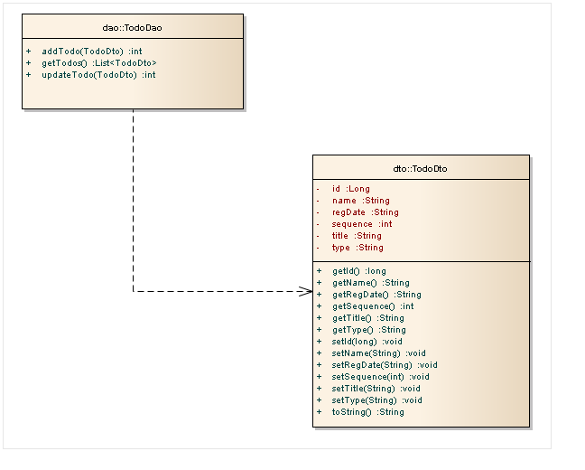

# boostcourse-webPrj
**부스트코스 웹 프로그래밍 프로젝트 일지 (소스는 private repository에 있음)**

### 1.  웹 프로그래밍 기초 - > [aboutme](https://github.com/DevLimK1/boostcourse-web/tree/master/aboutme)

#### 나를 소개하는 홈페이지 만들기: GitLab에서 코드리뷰 받고 PASS

---
### 2. DB 연결 웹 앱 

#### To Do List 구현하기

##### 200505 (화)

- 할 일 목록 화면(리스트) :todo-list.html / style.css  구현완료

- 할 일 등록 화면(쓰기) : add-todo.html  / add-style.css 구현완료

---

##### 200508 (금)

- tododb구축

- 테이블 생성 및 데이터 insert

- TodoDao -  List <TodoDto> getTodos()구현 
- TodoDto 구현

- tododb에 있는 데이터와 JDBC 연결이 잘 되어 결과값 출력되는지 확인

---

##### 200510 (일)

- TodoDao - int addTodo(TodoDto dto) / int updateTodo(TodoDto dto) 
- MainServlet 구현하여 TodoDao를 이용해 결과를 조회해서 main.jsp에 전달해서 브라우저에 출력
- MainServlet에서 포워딩해서 전달받은 결과를 main.jsp에서 JSTL과 EL을 이용해 출력

---

##### 200511(월)

- 새로운todo등록 버튼을 클릭하면 TodoFormServlet이 실행되고, TodoFormServlet은 todoForm.jsp로 포워딩하여 할 일 등록 화면을 보여주기 구현

##### 200517(일)

- 해야할일의 "->" 버튼을 클릭하면 해당 해야할일의 id와 현재 type값을 TodoTypeServlet에게 전달한다.

- TodoTypeServle은 id에 해당하는 해야할일의 type을 TODO라면 DOING으로, DOING이라면 DONE으로 변경한다.
- **서블릿을 통한 버튼 이동은 구현했는데 javascript ajax를 활용한 버튼 이동 부분 해결중.. (특히, 여러 버튼 중에 -> 버튼 클릭하면 해당 리스트만 움직임을 동작하는 이벤트핸들러 관련해서 어려움을 겪고있음, )**

