# [부스트코스(boostcourse-web)](https://www.edwith.org/boostcourse-web)

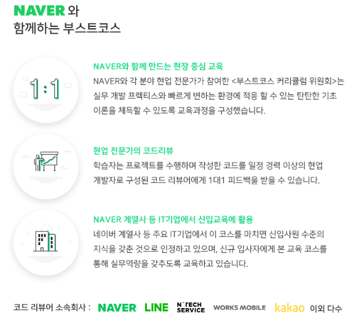

#### 목표역량

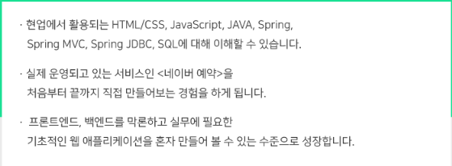

#### 학습방법

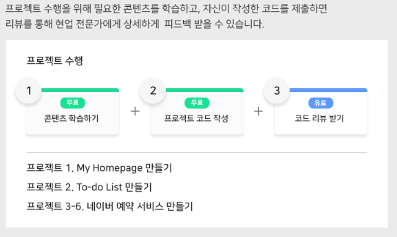

##### 참고)

##### 프로젝트 소스코드는 *부스트코스 정책상의 이유*로 공개할 수가 없어서 private repository에 있습니다.

## 1.  웹 프로그래밍 기초

##### 

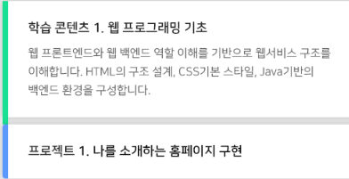

**개발환경**

- [JDK 설치(ver 1.8)](http://www.oracle.com/technetwork/java/javase/downloads/java-archive-javase8-2177648.html)
- 이클립스 설치
- [tomcat 설치(ver 8.5)](https://tomcat.apache.org/download-80.cgi#8.5.31)

**웹프론트엔드 기술요구사항**

- html layout tag를 사용합니다.
- classname은 일정한 컨벤션을 유지합니다.
- 의미에 맞는 tag를 최대한 사용합니다. (div 사용은 최대한 자제)
- position속성과 float를 사용해서 element를 배치합니다.
- 라이브러리를 사용한 레이아웃은 지양합니다. (부트스트랩 등)
- id와 class등의 다양한 selector문법을 잘 활용해야 합니다.

 

**웹백엔드 기술요구사항**

- 톰캣서버를 통해서 자기소개 페이지가 동작되야 합니다. (ex http://localhost:8080/aboutme/index.html 에서 노출)
- 서블릿페이지하나를 생성해서, url을 입력했을 때 시간데이터가 화면에 노출돼야 합니다.

#### BE_평가기준표

##### 기능

| 기준                   | 세부항목                                                     |
| :--------------------- | ------------------------------------------------------------ |
| 페이지 네비게이션 구현 | - 화면 우측 상단에 4개 링크를 눌렀을 때 해당 페이지로 이동해서 화면이 노출된다.  - 각각 4개의 페이지에서 모두 정상 동작해야 한다.   - index.html의 화면중앙의 자기소개, 내사진을 클릭했을 때 해당 페이지로 이동해서 화면이 노출된다 |
| 현재시간노출 구현      | - http://localhost:8080/aboutme/today 직접 접속하거나, 네비게이션의 링크를 통해서 today에 접속하면 현재시간이 노출된다.  - 노출되는 시간은 서블릿에서 화면을 생성하므로 디자인을 고려하지 않아도 된다. |

##### 소스코드

| 기준            | 세부항목                                                     |
| :-------------- | ------------------------------------------------------------ |
| JAVA 코드스타일 | 자바의 코딩 규칙은 아래에서 제공한 링크를 참고 할 수 있다. [SUN 가이드](http://www.oracle.com/technetwork/java/codeconventions-150003.pdf) [Google 가이드](https://google.github.io/styleguide/javaguide.html)  이번 프로젝트에서는 최소한 아래 제시한 규칙들은 지켜야 한다.   - JAVA Naming Conventions 을 지킨다. [(참고)](http://www.oracle.com/technetwork/java/codeconventions-135099.html)  - 코드는 빈줄을 이용해 커다란 블록을 논리적인 문단으로 구분한다.  - 코드는 들여쓰기를 잘 지키도록 한다. - 불필요한 주석문은 사용하지 않는다. |
| JAVA            | -현재 시간은 java.time.LocalDateTime클래스를 이용해서 구한다.  -날짜 시간을 화면에 표시하기 위한 형식을 지정하고 Formatter 를 사용한다. |

#### FE_평가기준표

##### 화면 레이아웃

| 기준                  | 세부항목                                                     |
| :-------------------- | ------------------------------------------------------------ |
| index.html 레이아웃   | - 상단 네비게이션의 홈,자기소개,내사진,몇시에요 간의 간격은 같아야 한다.  - 모든 콘텐츠는 가운데 정렬되야 한다.  - 네모난 UI는 그림자효과를 주어야 한다  - 링크해당하는 영역은 마우스를 올렸을때 커서모양이 손 모양으로 변경되어야 한다. |
| aboutme.html 레이아웃 | - index와 같이 간격과 배치를 동일하게 유지해야 한다.  - 같은 수준의 태그에서는 같은 크기의 글자 크기를 유지해야 한다.  - 세가지 영역간의 간격(높이)는 같아야 한다. |
| photo.html 레이아웃   | - index,about과 마찬가지로 동일한 성격의 이미지나 문장은 같은 간격과 글자 크기를 유지해야  - 사진에는 테두리가 존재한다. |
| 현재시간 페이지 구현  | - 화면 기준 상하50%의 위치(정가운데)에 현재시간이 기획서와 같이 노출된다. |

##### 기능

| 기준                   | 세부항목                                                     |
| :--------------------- | ------------------------------------------------------------ |
| 페이지 네비게이션 구현 | - 화면 우측 상단에 4개 링크를 눌렀을 때 해당 페이지로 이동해서 화면이 노출된다.  - 각각 4개의 페이지에서 모두 정상 동작해야 한다.  - index.html의 화면중앙의 자기소개, 내사진을 클릭했을 때 해당 페이지로 이동해서 화면이 노출된다 |
| 현재시간노출 구현      | - http://localhost:8080/aboutme/today 직접 접속하거나, 네비게이션의 링크를 통해서 today에 접속하면 현재시간이 노출된다.  - 노출되는 시간은 서블릿에서 화면을 생성하므로 디자인을 고려하지 않아도 된다. |

##### 소스코드

| 기준                               | 세부항목                                                     |
| :--------------------------------- | ------------------------------------------------------------ |
| HTML 태그로 구조화설계             | - css classname은 일정한 컨벤션을 유지해야 한다.  - html layout 태그를 사용해야 한다.  - 의미에 맞는 tag를 최대한 사용한다. (div만을 사용한다던가 하면 안됨) |
| CSS Layout과 기본 selector문법사용 | - position속성과 float를 사용해서 element를 배치해야 한다.  - id와 class등의 다양한 selector문법을 잘 활용해야 한다. |

### 구현한 기능

- 홈 _ header ,main, footer UI 구현

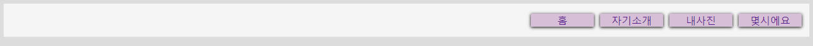

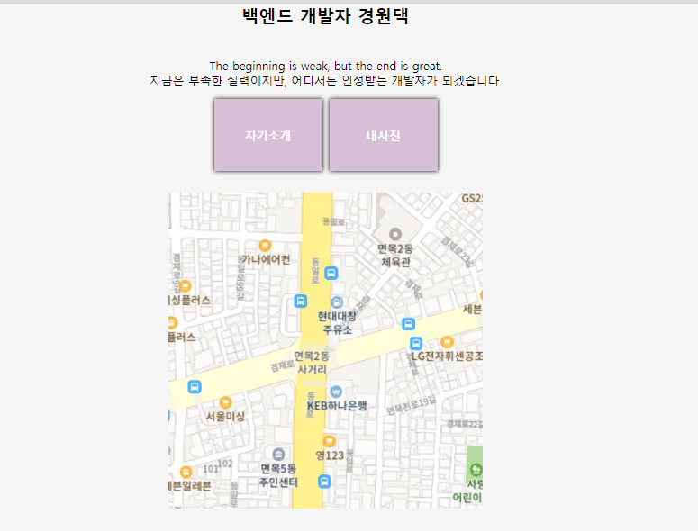

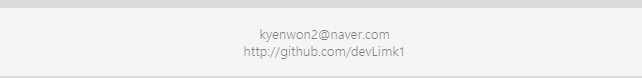

#### 나를 소개하는 홈페이지 만들기: GitLab에서 코드리뷰 받고 PASS

[소스코드](https://github.com/DevLimK1/boostcourse-web/tree/master/aboutme)

---
## 2. DB 연결 웹 앱 

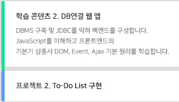

#### To Do List 구현하기

##### 200505 (화)

- 할 일 목록 화면(리스트) :todo-list.html / style.css  구현완료

- 할 일 등록 화면(쓰기) : add-todo.html  / add-style.css 구현완료

---

##### 200508 (금)

- tododb구축

- 테이블 생성 및 데이터 insert

- TodoDao -  List <TodoDto> getTodos()구현 
- TodoDto 구현

- tododb에 있는 데이터와 JDBC 연결이 잘 되어 결과값 출력되는지 확인

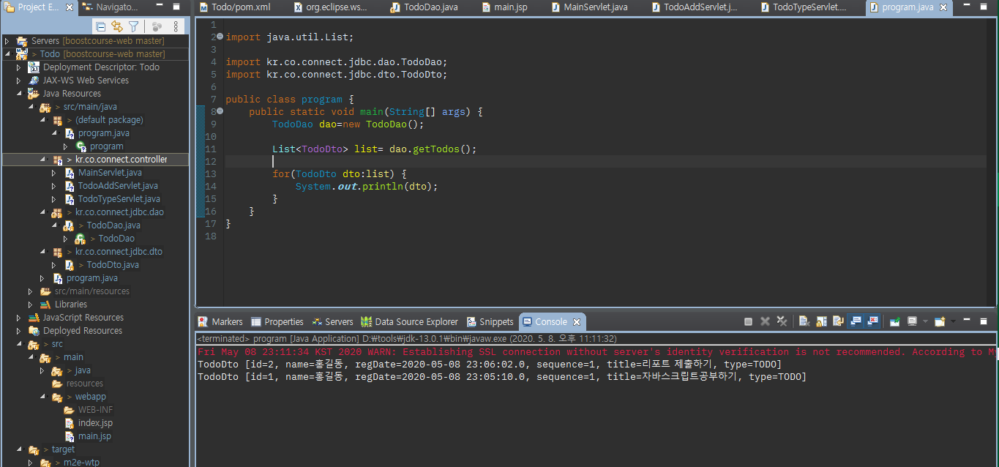

---

##### 200510 (일)

- TodoDao - int addTodo(TodoDto dto) / int updateTodo(TodoDto dto) 
- MainServlet 구현하여 TodoDao를 이용해 결과를 조회해서 main.jsp에 전달해서 브라우저에 출력
- MainServlet에서 포워딩해서 전달받은 결과를 main.jsp에서 JSTL과 EL을 이용해 출력

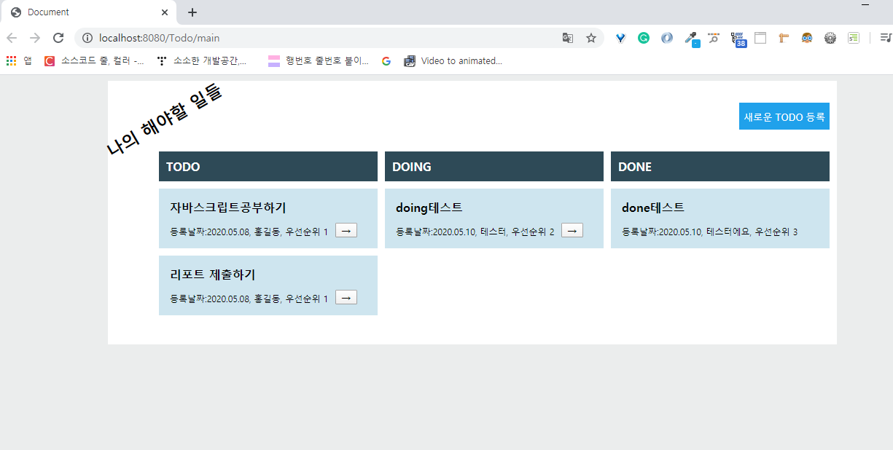

---

##### 200511(월)

- 새로운todo등록 버튼을 클릭하면 TodoFormServlet이 실행되고, TodoFormServlet은 todoForm.jsp로 포워딩하여 할 일 등록 화면을 보여주기 구현

##### 200517(일)

- 해야할일의 "->" 버튼을 클릭하면 해당 해야할일의 id와 현재 type값을 TodoTypeServlet에게 전달한다.

- TodoTypeServle은 id에 해당하는 해야할일의 type을 TODO라면 DOING으로, DOING이라면 DONE으로 변경한다.
- **서블릿을 통한 버튼 이동은 구현했는데 javascript ajax를 활용한 버튼 이동 부분 해결중.. (특히, 여러 버튼 중에 -> 버튼 클릭하면 해당 리스트만 움직임을 동작하는 이벤트핸들러 관련해서 어려움을 겪고있음, )**

## 3. 웹 앱 개발

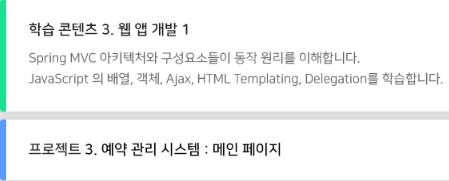

